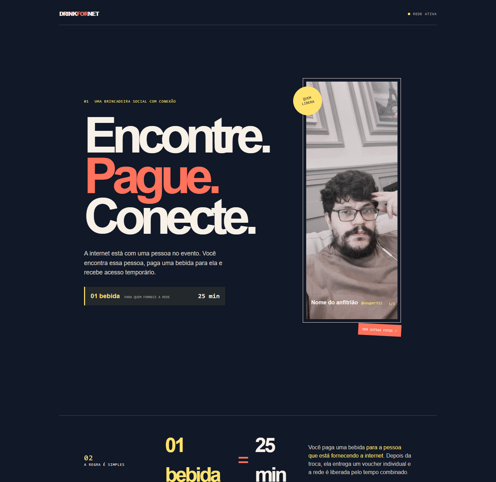
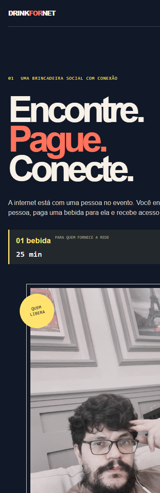

# DrinkForNet Wi-Fi 🚀

[Português](README.md) · [English](README.en.md)

[](LICENSE)
[](wifi-free.html)
[](script.js)

> **An open-source portable captive-portal experience for turning connectivity into a real-world social interaction.**

## 🌐 Try the demo

**[▶️ Open the landing page](https://uaigoiano-max.github.io/DrinkForNetWifi/)**

The demo shows the visitor experience on desktop and mobile. Voucher creation, authentication and session expiration still depend on the captive portal configured on the router.

> **Model B under review:** the new responsive interface is available in [Pull Request #2](https://github.com/uaigoiano-max/DrinkForNetWifi/pull/2). After the pull request is merged, the link above will automatically show this version on GitHub Pages.

> **Archived version:** the personalized demonstration used before this repository became a reusable template is preserved in the [`v1.0-personal-template`](https://github.com/uaigoiano-max/DrinkForNetWifi/releases/tag/v1.0-personal-template) release. Use it for reference only; new projects should start from the current version.

## What is DrinkForNet?

DrinkForNet is a reusable Wi-Fi landing page for a person who wants to bring a portable network to a party, festival or live event. The network does not need to be official or provided by the event organizers: it is made available by someone at the venue who wants to create a fun interaction with other people. The new interface makes the core exchange explicit: **one drink for the person providing the network unlocks 25 minutes of access**.

Instead of sharing a global password, the host can define a clear and voluntary exchange, such as:

- offering a drink;
- following a social profile;
- participating in content creation;
- sharing a profile or project;
- making a future donation;
- another interaction agreed with the host.

The visitor connects to the temporary Wi-Fi, sees the landing page, finds the person providing the network and receives an individual voucher. The router validates the voucher and grants temporary access.

> The interaction must be clear, optional and respectful. DrinkForNet is not an official event network unless the person operating it explicitly has that role.

## ✨ Features

- Responsive static landing page with no framework.
- Captive-portal form with firmware placeholders.
- Individual temporary voucher flow.
- Configurable host name, social links, texts, access duration and photos.
- Local-first operation for networks without external internet access.
- Accessible gallery with keyboard and reduced-motion support.
- Hardware guidance for travel routers, powerbanks and cables.
- Automatic validation for critical files and captive-portal placeholders.

## 📸 Preview

### Desktop

<p align="center">
  
</p>

### Mobile

<p align="center">
  
</p>

## 🚀 Quickstart

```bash
git clone https://github.com/uaigoiano-max/DrinkForNetWifi.git
cd DrinkForNetWifi
python -m http.server 8080
```

Open `http://localhost:8080/index.html`. For the captive-portal entry point, also test `http://localhost:8080/wifi-free.html`.

Run the project checks:

```bash
node scripts/validate-project.mjs
node --check script.js
node --check config.js
```

Read the full [Quickstart guide](QUICKSTART.md) for router deployment and physical testing.

## 🎛️ Customize the project

Start with [`config.js`](config.js):

```javascript
window.DrinkForNetConfig = {
    hostName: "Your name",
    nickname: "@yourprofile",
    accessMinutes: 25,
    socialLinks: {
        instagram: "https://instagram.com/yourprofile",
        x: "",
        spotify: ""
    },
    photos: [
        "minha-foto.jpg",
        "foto-2.jpg",
        "foto-3.jpg"
    ]
};
```

You can customize:

- host name and social profile;
- hero text and exchange rule;
- access duration;
- location instructions;
- photos and gallery caption;
- social links and colors.

Keep `index.html` and `wifi-free.html` synchronized. The captive portal form depends on these placeholders:

```html
$authaction
$tok
$redir
```

Do not remove or rename them without checking the captive-portal firmware documentation.

## 🧱 Architecture

| Layer | Technology |
| --- | --- |
| Structure | Static HTML |
| Styling | Responsive CSS and native animations |
| Interaction | Vanilla JavaScript |
| Authentication | Captive-portal form placeholders |
| Hosting | Preferably local on the router or hotspot |
| Network | Guest Wi-Fi with captive portal |

The page does not create the Wi-Fi network, issue vouchers or expire sessions by itself. Those responsibilities belong to the router, hotspot firmware or authentication service.

## 🛰️ Hardware

See the complete [recommended hardware guide](docs/RECOMMENDED_HARDWARE.md) for:

- Cudy TR1200 travel router;
- Anker 25,000 mAh powerbank;
- USB-A to USB-C and USB-C to USB-C cables;
- power compatibility and testing instructions;
- captive-portal and voucher limitations.

Hardware recommendations are references, not guarantees. Confirm the exact model, firmware, input voltage, voucher support and expected number of clients before buying or operating at an event.

## 🔐 Safety and privacy

- Isolate guest clients from the administration network.
- Change default router credentials.
- Do not commit vouchers, keys, certificates or personal data.
- Test the captive portal with valid and invalid vouchers.
- Do not monitor people or intercept traffic.
- Respect the rules of the event, venue and internet provider.

Read [SECURITY.md](SECURITY.md) for reporting and operational guidance.

## 💡 Roadmap: Pix donations

The Portuguese version documents a planned future feature for donation-based access using Pix in Brazil. This feature is not implemented yet.

A safe implementation will require payment confirmation, fraud prevention, privacy protection and a secure captive-portal integration. Do not publish a real Pix key or promise automatic access based only on a form or payment screenshot.

People interested in contributing to this future feature can send a private message to the project maintainer with their experience and proposed contribution.

## 🤝 Contributing

Contributions are welcome through Pull Requests. Please read:

- [CONTRIBUTING.md](CONTRIBUTING.md)
- [CODE_OF_CONDUCT.md](CODE_OF_CONDUCT.md)
- [SECURITY.md](SECURITY.md)

The `main` branch requires a Pull Request and a successful validation workflow. External contributions require review before merging; repository administrators may merge their own reviewed Pull Requests.

## 📄 License

This project is available under the [MIT License](LICENSE).
