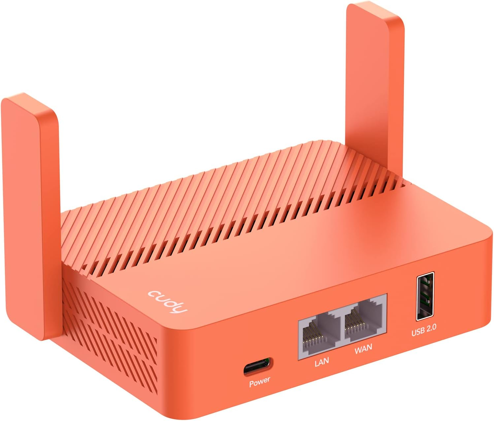
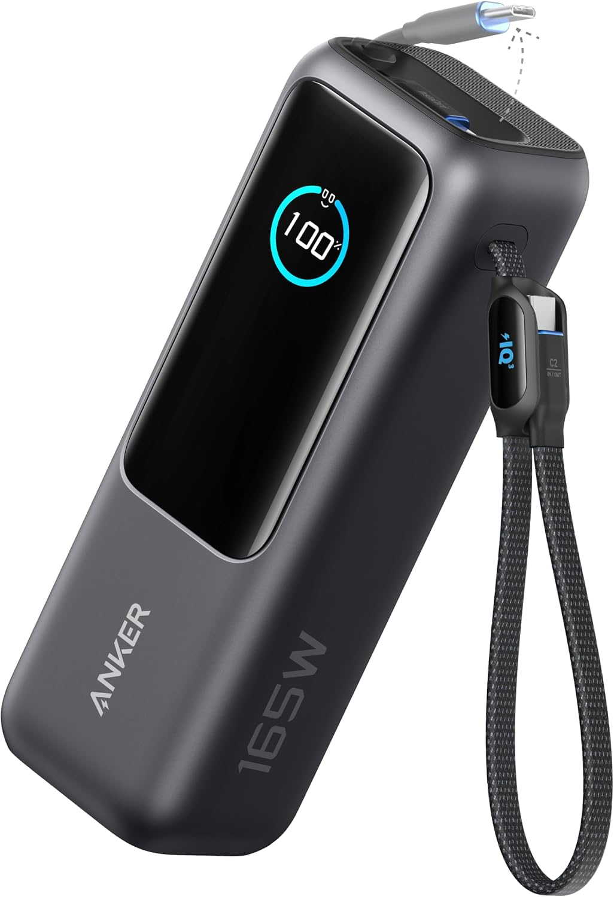

# DrinkForNet Wi-Fi 🚀

[](LICENSE)
[](wifi-free.html)
[](script.js)

> **A portable captive-portal experience for turning connectivity into a real-world encounter.**

## 🌐 Abra a demonstração

> **[▶️ Abrir a landing page no navegador](https://uaigoiano-max.github.io/DrinkForNetWifi/)**

Use o link acima para visualizar a experiência do visitante em um celular, tablet ou computador. Esta é uma demonstração visual; a emissão e a validação de vouchers continuam dependendo do captive portal configurado no roteador.

## Wi-Fi VIP para quem sabe onde encontrar a conexão

> **Você está procurando internet?**  
> Então encontre quem está disponibilizando a rede, participe da dinâmica e desbloqueie seu próximo intervalo de conexão.

O **DrinkForNet** é uma experiência de acesso Wi-Fi criada para uma pessoa levar a festas, festivais e outros eventos presenciais. A rede não precisa ser oficial nem fornecida pela organização: ela é disponibilizada por alguém que está no local e quer criar uma interação com outras pessoas. Em vez de entregar uma senha global em um cartaz ou QR Code compartilhado, o projeto transforma o acesso à internet em uma jornada curta, memorável e controlada:

1. A pessoa entra na rede Wi-Fi disponibilizada no evento.
2. O captive portal abre esta landing page premium.
3. A página explica a regra definida por quem está oferecendo a rede — por exemplo, **uma bebida vale 25 minutos de Wi-Fi VIP**.
4. O visitante encontra essa pessoa na pista, no backstage ou no ponto combinado.
5. Após a interação, recebe um voucher individual.
6. O voucher é validado pelo roteador e libera o acesso temporário.
7. Quando os 25 minutos terminam, o acesso expira e a experiência pode começar novamente.

Essa dinâmica pode ser usada para conhecer pessoas, ganhar seguidores, criar conteúdo, divulgar um perfil, receber uma bebida ou simplesmente tornar a conexão mais divertida. A contrapartida é definida pelo anfitrião e deve ser sempre clara, voluntária e respeitosa.

O projeto combina **design de produto, infraestrutura portátil, captive portal e uma mecânica social presencial** — uma pequena interface na borda da rede com uma grande capacidade de gerar interação no mundo real.

---

## 👀 Veja a experiência antes de instalar

A landing page foi desenhada para funcionar como uma interface de evento: uma pessoa conecta ao Wi-Fi, reconhece quem está disponibilizando a rede, entende a dinâmica em poucos segundos e chega ao campo de voucher sem precisar navegar por menus complexos.

### Visão desktop

<p align="center">
  
</p>

### Visão mobile

<p align="center">
  
</p>

> As imagens acima são uma demonstração real da interface incluída neste repositório. Nome, fotos, links, cores, textos e regras de acesso podem ser personalizados seguindo o [guia de personalização](#-como-personalizar-o-projeto).

Para colocar uma cópia no ar rapidamente, siga o [Quickstart](QUICKSTART.md). As indicações de roteador, powerbank e cabos ficam no [guia de hardware recomendado](docs/RECOMMENDED_HARDWARE.md).

### O que o visitante vê

```text
┌─────────────────────────────────────┐
│ PAGA E LIBERO          REDE ATIVA   │
│                                     │
│          [foto do anfitrião]        │
│          [nome da pessoa]           │
│          [@perfil social]           │
│                                     │
│       QUER INTERNET?                │
│         ME ENCONTRE.                │
│                                     │
│       [redes sociais]               │
├─────────────────────────────────────┤
│ 01  A REGRA É SIMPLES              │
│     1 bebida = 25 min de Wi-Fi     │
│                                     │
│ 02  ONDE ENCONTRAR                 │
│     Ponto combinado                 │
│                                     │
│ 03  ACESSAR REDE                  │
│     [ CÓDIGO DE ACESSO ]           │
│     [ LIBERAR WI-FI           → ]  │
└─────────────────────────────────────┘
```

---

## ✨ O que este projeto entrega

- Landing page responsiva com estética premium inspirada em produtos como Stripe e Linear.
- Fluxo de voucher temporário integrado ao formulário de autenticação do captive portal.
- Galeria de fotos para facilitar o reconhecimento de quem disponibiliza a rede.
- Instruções objetivas de localização, como **na pista**, **atrás do palco** ou outro ponto combinado.
- Links sociais para identificação e contato.
- Compatibilidade conceitual com operações baseadas em Starlink, 4G/5G, roteadores de viagem e firmware com suporte a hotspot autenticado.
- Interface preparada para uso rápido em telas pequenas, em ambientes com pouca luz e alta circulação.

> **Importante:** este repositório contém a experiência web. A emissão, validação, expiração e revogação dos vouchers acontecem no equipamento ou serviço de captive portal escolhido para a operação.

---

## 🧠 A arquitetura do modelo: vouchers de 25 minutos

O DrinkForNet **não distribui uma senha única** e também não depende de um QR Code global que possa ser fotografado e compartilhado indefinidamente.

O modelo utiliza **vouchers temporários individuais**:

```text
Visitante conecta na rede
          │
          ▼
Captive Portal abre a landing page
          │
          ▼
Visitante encontra quem disponibiliza a rede
          │
          ▼
Recebe um voucher individual
          │
          ▼
Voucher é validado pelo hotspot
          │
          ▼
25 minutos de acesso
          │
          ▼
Expiração automática e desconexão
```

### Regras do acesso

| Regra | Comportamento |
| --- | --- |
| Duração | 25 minutos por voucher |
| Identidade | Um código individual por acesso |
| Compartilhamento | Evitado por não existir uma senha global |
| Expiração | Controlada pelo hotspot/captive portal |
| Renovação | Novo voucher após nova interação |
| Landing page | Explica o fluxo e coleta o voucher |

Essa abordagem cria um ciclo simples:

> **Encontrar → interagir → receber voucher → conectar → aproveitar → repetir**

O tempo de 25 minutos é curto o suficiente para controlar o consumo de banda e longo o suficiente para resolver uma necessidade real: enviar uma mensagem, chamar um transporte, publicar um story ou consultar uma informação do evento.

---

## 🧱 Stack visual e técnica

| Camada | Tecnologia |
| --- | --- |
| Estrutura | HTML sem framework |
| Estilos | CSS responsivo e animações nativas |
| Interações | JavaScript vanilla |
| Imagens | Arquivos locais otimizáveis |
| Autenticação | Formulário compatível com placeholders de captive portal |
| Hospedagem | Preferencialmente no próprio roteador/captive portal |
| Rede | Hotspot autenticado com captive portal |

As fontes usam fallbacks do sistema para que a interface continue carregando quando o visitante ainda não tem acesso à internet externa. Isso evita depender de CDNs durante a autenticação do captive portal.

### Estrutura esperada

```text
wifi-free/
├── index.html           # Entrada da demonstração e página pública
├── wifi-free.html       # Landing page do captive portal
├── style.css            # Sistema visual, responsividade e animações
├── script.js            # Galeria, validação e interações
├── config.js            # Nome, links, fotos e textos personalizáveis
├── QUICKSTART.md        # Instalação rápida
├── docs/RECOMMENDED_HARDWARE.md
│                         # Roteador, powerbank e cabos
├── scripts/validate-project.mjs
│                         # Validação local dos arquivos críticos
├── minha-foto.jpg       # Foto principal de identificação
├── foto-2.jpg           # Foto complementar
├── foto-3.jpg           # Foto complementar
├── docs/hardware/       # Imagens de equipamentos indicados
└── README.md            # Documentação da operação
```

---

## 🎛️ Como personalizar o projeto

O projeto é estático e não exige build. Para criar uma versão para outro anfitrião, evento ou marca, comece por `config.js` e copie os arquivos atualizados para o captive portal.

`index.html` e `wifi-free.html` são mantidos com o mesmo conteúdo para atender tanto à demonstração do GitHub Pages quanto a firmwares que exigem um nome específico para a página do portal. Depois de alterar `wifi-free.html`, replique a alteração em `index.html` antes de publicar.

### 1. Troque nome, apelido e textos

Para a maioria das personalizações, edite somente estes campos em `config.js`:

```javascript
window.DrinkForNetConfig = {
    hostName: "Nome do anfitrião",
    nickname: "@usuario",
    accessMinutes: 25,
    socialLinks: {
        instagram: "https://instagram.com/usuario",
        x: "https://x.com/usuario",
        spotify: "https://open.spotify.com/"
    },
    photos: [
        "minha-foto.jpg",
        "foto-2.jpg",
        "foto-3.jpg"
    ]
};
```

O objeto completo também contém os textos do hero, regra da troca, instruções de localização, legenda da galeria e título da página. A edição centralizada evita procurar os mesmos dados em vários arquivos.

Se precisar de uma alteração estrutural ou de um texto que não exista no `config.js`, abra `wifi-free.html` e procure pelos seletores correspondentes:

```html
<div class="profile-name">
    Thiago
</div>

<div class="profile-nickname">
    @UaiGoiano
</div>
```

Altere também:

- o título principal (`<h1>`);
- a descrição do hero (`.hero-description`);
- a regra da troca (`.access-copy-values`);
- o tempo de acesso e a unidade da oferta;
- os textos de **NA PISTA** e **ATRÁS DO PALCO**;
- a legenda da galeria;
- os textos do rodapé.

Faça uma busca global por `Thiago`, `UaiGoiano`, `25` e `bebida` para localizar todas as referências antes de publicar.

### 2. Atualize as redes sociais

Os links ficam em `wifi-free.html`, dentro de `.social-links` e também na seção de localização:

```html
<a
    href="https://instagram.com/SEU_USUARIO"
    class="social-link"
    target="_blank"
    rel="noopener noreferrer"
    aria-label="Siga-me no Instagram"
>
```

Atualize:

| Rede | Local a alterar |
| --- | --- |
| Instagram | Link do ícone social e link em `NA PISTA` |
| X | Link do ícone social |
| Spotify | Link do ícone social |

Se uma rede não for utilizada, remova o `<a>` completo com o respectivo SVG. Não deixe `href="#"`, pois isso cria links sem destino e pode levar o visitante ao topo da página.

### 3. Substitua as fotos

Mantenha os nomes esperados ou altere os caminhos em dois lugares:

1. `wifi-free.html`, na imagem principal e na imagem inicial da galeria.
2. `script.js`, no array `photos`.

```javascript
const photos = [
    "minha-foto.jpg",
    "foto-2.jpg",
    "foto-3.jpg"
];
```

Recomendações para fotos de evento:

- use imagens nítidas, mas comprimidas;
- prefira `WebP` ou `AVIF` quando o firmware suportar;
- mantenha proporção semelhante entre as fotos;
- use uma foto principal fácil de reconhecer;
- evite arquivos individuais muito grandes em roteadores com pouco armazenamento;
- atualize o `alt` se a pessoa retratada mudar.

Para uma operação mais leve, exporte a foto principal em aproximadamente `800px` no maior lado e as fotos da galeria em aproximadamente `1200px`, ajustando conforme a qualidade visual necessária.

### 4. Altere a oferta e a duração

O valor aparece em mais de um trecho da interface. Se a duração deixar de ser 25 minutos, atualize:

- a chamada principal;
- o card de regras;
- as estatísticas;
- o rodapé;
- o texto do README;
- a duração configurada no captive portal.

> A página não controla a expiração da sessão. O número exibido no HTML precisa ser igual ao tempo configurado no roteador, caso contrário a comunicação ficará inconsistente.

### 5. Troque cores e identidade visual

As cores principais estão concentradas em `style.css`. Procure por:

```css
#c6ff4d  /* lima: ação, destaque e status */
#0a1120  /* navy: fundo e contraste */
#9ca3af  /* cinza: texto secundário */
```

Para uma personalização segura:

1. troque primeiro a cor de destaque;
2. preserve contraste suficiente entre texto e fundo;
3. revise estados `:hover`, `:focus-visible` e `:disabled`;
4. teste em ambiente escuro e em telas pequenas;
5. não remova o contorno de foco para usuários de teclado.

### 6. Ajuste a marca e o título do navegador

No `<head>` de `wifi-free.html`, edite:

```html
<meta
    name="description"
    content="Descrição curta do acesso Wi-Fi e do evento."
>

<title>Wi-Fi VIP — Nome do anfitrião</title>
```

Também atualize o `meta name="theme-color"` para combinar com a nova identidade visual.

### 7. Verifique o formulário do captive portal

O formulário contém variáveis que normalmente são substituídas pelo firmware:

```html
<form method="POST" action="$authaction" id="voucherForm">
    <input type="hidden" name="tok" value="$tok">
    <input type="hidden" name="redir" value="$redir">
    <input type="text" name="voucher" id="voucher">
</form>
```

Não remova ou renomeie esses campos sem consultar a documentação do captive portal. A aparência da página pode ser alterada livremente, mas o contrato de autenticação depende do equipamento.

### 8. Checklist rápido após personalizar

- [ ] O nome e o apelido estão corretos em toda a página.
- [ ] Todos os links sociais apontam para perfis reais.
- [ ] Não existem links `href="#"`.
- [ ] Todas as fotos carregam no roteador.
- [ ] Os `alt` descrevem corretamente as imagens.
- [ ] O tempo exibido é igual ao tempo do voucher.
- [ ] O formulário mantém `$authaction`, `$tok` e `$redir`.
- [ ] A página funciona sem internet externa.
- [ ] O layout foi testado em um celular.
- [ ] O captive portal foi testado com voucher válido e inválido.

---

## ⚡ Fluxo recomendado de edição e publicação

```text
1. Copiar o projeto para uma pasta de trabalho
2. Editar wifi-free.html
3. Atualizar fotos e links em script.js / HTML
4. Ajustar cores em style.css
5. Testar localmente
6. Copiar arquivos para o captive portal
7. Testar conectado apenas à rede Wi-Fi
8. Gerar os vouchers do evento
9. Validar expiração de 25 minutos
10. Abrir a operação ao público
```

Teste local simples:

```bash
python -m http.server 8080
```

Depois, abra:

```text
http://localhost:8080/wifi-free.html
```

O servidor local valida a interface, mas não simula a autenticação real. O teste final precisa acontecer conectado ao roteador configurado.

---

## 🛰️ Guia de hardware recomendado

> A lista completa, com imagens, links, instruções de alimentação e cabos, está em [docs/RECOMMENDED_HARDWARE.md](docs/RECOMMENDED_HARDWARE.md). A seção abaixo mantém o contexto técnico da escolha e da operação.

O projeto foi pensado para ser transportável. A internet de origem pode mudar; a experiência do visitante permanece a mesma.

> “Recomendado” não significa que qualquer modelo tenha todas as funções prontas. Antes da compra, confirme: captive portal personalizado, vouchers com expiração, armazenamento de arquivos, modo de autenticação e suporte ao número de clientes esperado.

### Produto indicado: Cudy TR1200

O **Cudy TR1200** é uma opção compacta para prototipagem e eventos pequenos. O modelo oferece Wi-Fi 5 AC1200, modos de operação para viagem, uma porta WAN, uma porta LAN, alimentação USB-C e suporte a OpenWrt conforme a versão/configuração anunciada pelo fabricante.

<p align="center">
  <a href="https://link.amazon/B09nTMBi1" target="_blank" rel="nofollow sponsored noopener">
    
  </a>
</p>

<p align="center">
  <a href="https://link.amazon/B09nTMBi1" target="_blank" rel="nofollow sponsored noopener"><strong>Ver o Cudy TR1200 na Amazon</strong></a>
</p>

> **Aviso de transparência:** este é um link de afiliado da Amazon. Se você comprar por ele, posso receber uma comissão sem custo adicional para você. Preços, estoque, impostos e condições podem mudar; confirme as informações na página da Amazon antes da compra.

**Por que ele faz sentido para este projeto:**

- formato pequeno para transporte entre eventos;
- alimentação compatível com powerbank USB-C;
- modos de viagem úteis para receber internet por Wi-Fi ou Ethernet;
- hardware adequado para testes de portal local e rede de convidados;
- possibilidade de expansão com firmware compatível, quando necessário.

**Antes de comprar:** o roteador, sozinho, não garante vouchers nem captive portal. Confirme a versão do firmware e valide a instalação do openNDS, Nodogsplash ou outra solução equivalente. Para muitos clientes, cobertura ampla ou operação crítica, use um equipamento mais robusto e faça um teste de carga antes do evento.

### Produto indicado: Anker Laptop Power Bank 25.000 mAh

Para operações móveis, o **Anker Laptop Power Bank de 25.000 mAh e até 165 W** é uma opção premium para alimentar o roteador e também recarregar celulares, notebooks e outros acessórios. O produto possui USB-C, cabos integrados e visor de carga.

<p align="center">
  <a href="https://link.amazon/B07Syolji" target="_blank" rel="nofollow sponsored noopener">
    
  </a>
</p>

<p align="center">
  <a href="https://link.amazon/B07Syolji" target="_blank" rel="nofollow sponsored noopener"><strong>Ver o powerbank Anker na Amazon</strong></a>
</p>

> **Aviso de transparência:** este é um link de afiliado da Amazon. Se você comprar por ele, posso receber uma comissão sem custo adicional para você. Preços, estoque, impostos, vendedor e condições podem mudar; confira as informações na página da Amazon antes da compra.

#### Como usar com o Cudy TR1200

O powerbank tem potência muito superior à necessária para um roteador de viagem. Isso não significa que ele “empurra” 165 W para o Cudy: o dispositivo conectado consome apenas a corrente e a tensão que aceita. Mesmo assim, confirme a tensão indicada na etiqueta ou no manual do seu TR1200 antes de ligar.

Para a primeira instalação, use o procedimento mais conservador:

1. Carregue completamente o powerbank antes do evento.
2. Conecte a saída **USB-A de 5 V** do powerbank à entrada USB-C de alimentação do Cudy usando um cabo USB-A para USB-C.
3. Ligue o roteador e aguarde a inicialização completa.
4. Teste a rede com dois ou mais celulares e mantenha o roteador funcionando por algumas horas.
5. Verifique se não há reinicializações, aquecimento excessivo ou perda de conexão.
6. Confirme se o powerbank permanece ligado; alguns modelos desligam quando detectam consumo muito baixo.

A saída USB-C também pode funcionar, mas depende da negociação USB Power Delivery entre os equipamentos. Não use adaptadores que forcem 9 V, 12 V, 15 V ou 20 V na entrada do Cudy. Se o manual do seu roteador especificar outra tensão, siga o manual e não esta orientação genérica.

> **Compatibilidade:** esta combinação é **compatível em princípio**, mas deve ser validada com o seu lote e firmware do TR1200 antes de uma operação pública. O README não substitui as especificações elétricas do fabricante.

#### Cabos recomendados

O cabo é parte importante da instalação. Um cabo ruim pode causar queda de tensão, reinicialização do roteador ou carregamento intermitente.

| Uso | Cabo indicado | Observação |
| --- | --- | --- |
| Alimentação mais conservadora | USB-A para USB-C, 1 m ou 1,5 m | Preferir cabo reforçado e compatível com 5 V |
| Alimentação via USB-C PD | USB-C para USB-C, 100 W | Usar somente após confirmar a tensão aceita pelo roteador |
| Reserva para celulares | USB-C para USB-C, 60 W ou 100 W | Bom para carregar celulares e acessórios |
| Emergência | USB-A para USB-C | Útil caso a negociação PD não funcione |

Prefira cabos de **Anker, UGREEN ou Baseus**, com conectores firmes, revestimento trançado e potência claramente informada. Para o Cudy, um cabo de 100 W não torna o roteador mais potente: ele apenas oferece margem elétrica e construção adequada. Não é necessário comprar cabo de 240 W para essa aplicação.

#### Checklist de segurança da alimentação

- [ ] A tensão de entrada do Cudy foi confirmada no manual ou na etiqueta.
- [ ] O cabo não está danificado, frouxo ou excessivamente longo.
- [ ] O roteador funcionou por algumas horas sem reiniciar.
- [ ] O powerbank não aquece de forma anormal.
- [ ] O powerbank não desliga por baixo consumo.
- [ ] Há um cabo reserva disponível.
- [ ] O teste foi repetido com o mesmo captive portal usado no evento.

### Matriz mínima de compatibilidade

| Capacidade | Necessária? | Como validar |
| --- | --- | --- |
| Servir HTML/CSS/JS localmente | Sim, no modo local | Testar upload de um `index.html`/splash page |
| Redirecionar clientes não autenticados | Sim | Conectar um celular e abrir um site HTTP/HTTPS |
| Emitir vouchers individuais | Sim | Gerar e consumir dois códigos de teste |
| Expirar sessão automaticamente | Sim | Usar voucher e aguardar o tempo configurado |
| Isolar clientes da rede administrativa | Sim | Conferir VLAN, guest network ou firewall |
| Limitar banda | Recomendado | Aplicar limite e medir em dois clientes |
| Alimentação por USB/powerbank | Recomendado | Operar desconectado da tomada |

### Opção A — Alta performance: Starlink

Ideal para eventos remotos, áreas rurais, festivais de grande porte ou locais sem infraestrutura confiável.

```text
Starlink
   │
   ├── Roteador Starlink em modo integrado
   │
   └── Roteador próprio em modo Bypass
           │
           ▼
      Hotspot / Captive Portal
           │
           ▼
      Rede Wi-Fi disponibilizada no evento
```

**Configurações possíveis:**

- **Modo integrado:** o roteador Starlink fornece a conectividade principal e o hotspot autenticado fica atrás dele.
- **Modo Bypass:** o equipamento próprio assume o papel de roteador e concentra DHCP, DNS, autenticação e política de vouchers.

O modo Bypass costuma ser mais interessante quando você precisa de controle centralizado sobre a rede. Antes do evento, valide a topologia, o comportamento do DHCP e a compatibilidade do firmware com o equipamento Starlink utilizado.

### Opção B — Ultra portátil: mini roteador de bolso GL.iNet

Ideal para uma operação pequena, deslocamento constante e configuração rápida.

Características desejáveis:

- Firmware baseado em OpenWrt ou interface equivalente.
- Cliente Wi-Fi e/ou tethering USB.
- Suporte a VPN quando necessário.
- Guest network ou hotspot autenticado.
- Alimentação USB-C ou micro-USB.
- Administração local protegida por senha.

As linhas GL.iNet são uma referência de portabilidade, mas o suporte exato a vouchers e captive portal varia por modelo, firmware e pacote instalado. Confirme essa capacidade antes da compra.

### Opção C — Desempenho de viagem: Cudy TR1200

O **Cudy TR1200**, ou outro roteador de viagem AC1200 equivalente, é uma alternativa para quem precisa de mais flexibilidade em deslocamentos.

Recursos relevantes:

- Wi-Fi 5 AC1200.
- Modos de operação variados.
- Cliente, repetidor, access point e roteamento.
- Suporte a VPN conforme firmware e configuração.
- Formato compacto para transporte.
- Possibilidade de receber internet por diferentes origens.

Assim como em qualquer hardware, valide se a versão adquirida oferece a função de **Hotspot / Guest Network with Authentication** ou se exige firmware, pacote ou servidor externo para emitir vouchers.

---

## 🎒 Por que roteadores de bolso são perfeitos para este projeto?

### 1. Captive portal nativo ou extensível

Roteadores de viagem com OpenWrt de fábrica, ou com suporte a pacotes de hotspot, podem oferecer:

- Guest network isolada.
- Redirecionamento para portal de autenticação.
- Cadastro de usuários ou vouchers.
- Limite de tempo por sessão.
- Controle de largura de banda.
- Expiração e revogação de credenciais.

Isso permite preparar um lote com **50 ou 100 vouchers temporários** em poucos minutos, dependendo do firmware e da interface utilizada.

> Nem todo equipamento anuncia “captive portal” com a mesma implementação. Alguns oferecem apenas guest network; outros exigem um pacote adicional, um servidor de autenticação ou uma solução como openNDS, CoovaChilli, Nodogsplash ou serviço equivalente.

### 2. Alimentação via powerbank

Um roteador de viagem consome pouca energia e pode ser alimentado por:

- Powerbank USB.
- Bateria portátil de alta capacidade.
- Fonte USB próxima ao backstage.
- Nobreak compacto em uma estação fixa.

Isso reduz a dependência de tomadas no meio da multidão e permite posicionar o ponto de acesso onde ele oferece melhor cobertura, sem transformar a operação em uma instalação complexa.

### 3. Versatilidade de sinal

O roteador pode receber internet de diferentes fontes:

```text
Celular 4G/5G ───────┐
                     ├── Roteador de bolso ── Hotspot autenticado
Starlink ────────────┘
```

Na prática, ele pode:

- Usar tethering USB do celular.
- Repetir ou receber uma rede Wi-Fi existente.
- Distribuir uma conexão Starlink instalada em outro ponto.
- Criar uma célula de internet otimizada ao redor da operação.
- Manter a landing page e o fluxo de autenticação consistentes entre eventos.

---

## 💡 Próximos passos: acesso por doação via Pix

Uma evolução planejada é permitir que a pessoa escolha entre a troca por uma bebida e uma **doação via Pix** para liberar o acesso à rede. Essa funcionalidade ainda não está implementada.

Para fazer isso corretamente, será necessário definir um fluxo seguro de confirmação do pagamento, evitar comprovantes falsos, proteger dados pessoais e integrar a confirmação ao captive portal sem expor chaves Pix ou credenciais no código público. Não use uma chave Pix real nem prometa liberação automática com base apenas em um formulário até que essa integração esteja pronta e testada.

Quem quiser colaborar com essa futura funcionalidade pode enviar uma mensagem privada ao mantenedor do projeto explicando sua experiência e a forma de contribuição pretendida. Sugestões de arquitetura, testes, segurança e integração são bem-vindas.

---

## 🔧 Guia de configuração e pareamento

### 1. Prepare a landing page no roteador

Para a operação descrita neste projeto, o caminho principal é copiar os arquivos da landing page **para o próprio roteador ou para o serviço de captive portal que roda nele**. Nesse modelo, a página abre mesmo antes de o visitante ter acesso à internet externa.

O local exato depende do firmware. Ele pode aparecer como:

```text
/www/
/www/portal/
/www/guest/
/etc/nodogsplash/htdocs/
/etc/opennds/htdocs/
```

Exemplo conceitual de implantação local:

```bash
scp wifi-free.html style.css script.js \
    minha-foto.jpg foto-2.jpg foto-3.jpg \
    root@192.168.8.1:/www/portal/
```

Em firmwares com painel web, use o campo de upload/importação do **Splash Page**, **Captive Portal**, **Hotspot** ou **Guest Portal**. Se o equipamento não permitir arquivos personalizados, será necessário instalar uma solução compatível — como openNDS, Nodogsplash ou equivalente — ou usar um servidor local separado conectado ao roteador.

Nesse cenário, a URL do portal costuma ser local:

```text
http://192.168.8.1/portal/wifi-free.html
```

ou um endereço interno equivalente definido pelo firmware.

### 1.1 Hospedagem externa: alternativa, não requisito

Vercel, Netlify, GitHub Pages e Cloudflare Pages só são necessários quando o captive portal **não hospeda a página localmente** ou quando você deliberadamente quer manter o front-end em um servidor externo.

```text
Modo local (recomendado):
Cliente → roteador → página hospedada no roteador

Modo externo:
Cliente → roteador → domínio público → landing page
```

No modo externo, todos os recursos da página precisam estar liberados na **walled garden** antes da autenticação. Isso inclui HTML, CSS, JavaScript, imagens, fontes e qualquer domínio adicional. O modo local é geralmente mais previsível, mais rápido e não depende de internet externa para exibir a interface.

### 2. Configure o roteador portátil

O fluxo geral é:

1. Conecte-se ao painel administrativo do roteador.
2. Atualize o firmware para uma versão estável.
3. Troque a senha administrativa padrão.
4. Configure a origem da internet: USB tethering, cliente Wi-Fi, Ethernet ou Starlink.
5. Crie uma rede exclusiva para visitantes.
6. Ative o modo **Hotspot**, **Guest Authentication** ou **Captive Portal**.
7. Defina a duração da sessão para 25 minutos.
8. Configure limites de velocidade e isolamento entre clientes.
9. Gere um lote de vouchers individuais.
10. Teste em um celular antes de abrir a rede ao público.

> Os nomes dos menus variam entre fabricantes. Consulte o manual do modelo e confirme se a função de voucher é nativa ou depende de um pacote adicional.

### 3. Aponte o portal para a landing page local

No painel do hotspot, procure campos semelhantes a:

```text
Captive Portal URL
Splash Page URL
External Portal
Login Page
Redirect URL
Walled Garden
```

No modo local, use a URL do servidor web do roteador ou a rota informada pelo firmware:

```text
http://192.168.8.1/portal/wifi-free.html
```

Em uma solução local, normalmente não é necessário liberar um domínio externo na **walled garden**, porque HTML, CSS, JavaScript e imagens são servidos pela própria rede do roteador.

Exemplo conceitual:

```text
Portal:
  http://192.168.8.1/portal/wifi-free.html

Walled Garden:
  # vazio para recursos locais
```

> O captive portal normalmente intercepta a navegação ou responde ao teste de conectividade do sistema operacional. Isso é diferente de simplesmente configurar um DNS para apontar para uma página: o firmware precisa executar a lógica de redirecionamento e autenticação.

Se você optar pelo modo externo, substitua o endereço local pela URL pública e adicione o domínio — além de qualquer CDN de fonte — à walled garden. Mesmo nesse caso, hospede fontes e imagens localmente sempre que possível.

### 4. Conecte o formulário ao mecanismo de autenticação

O formulário usa placeholders normalmente substituídos pelo ambiente do captive portal:

```html
<form method="POST" action="$authaction">
    <input type="hidden" name="tok" value="$tok">
    <input type="hidden" name="redir" value="$redir">
    <input type="text" name="voucher" id="voucher">
    <button type="submit">LIBERAR WI-FI</button>
</form>
```

Esses valores são específicos do firmware ou da plataforma de autenticação. Antes da operação:

- verifique os nomes exatos dos parâmetros;
- substitua os placeholders conforme a documentação do hotspot;
- confirme se o voucher é enviado por `POST`, `GET` ou API;
- valide o redirecionamento após login;
- teste a expiração real da sessão;
- confirme que um voucher usado não pode ser reutilizado indevidamente.

### 5. Salve os vouchers para entrega rápida

Depois de gerar o lote no painel do roteador:

1. Exporte os códigos, se o firmware permitir.
2. Remova dados administrativos que não devem circular.
3. Copie somente os vouchers para uma nota protegida no celular.
4. Organize os códigos em linhas individuais.
5. Marque como usado imediatamente após a entrega.
6. Nunca publique o lote em grupo aberto, story ou QR Code público.

Formato sugerido:

```text
DRINK-01  ☐ disponível
DRINK-02  ☐ disponível
DRINK-03  ☐ disponível
DRINK-04  ☐ disponível
DRINK-05  ☐ disponível
```

Se possível, utilize um gerenciador de senhas ou nota protegida por biometria em vez de uma anotação sem proteção.

---

## 🧪 Checklist de teste antes do evento

### Rede

- [ ] O roteador recebe internet da fonte escolhida.
- [ ] O DHCP entrega endereços corretamente.
- [ ] Clientes ficam isolados entre si.
- [ ] A rede administrativa não está exposta aos visitantes.
- [ ] O limite de velocidade foi configurado.
- [ ] O sinal cobre a área planejada.

### Captive portal

- [ ] Android abre a landing page.
- [ ] iPhone abre a landing page.
- [ ] Notebook abre a landing page.
- [ ] O domínio está na walled garden.
- [ ] CSS, JavaScript, fotos e fontes carregam.
- [ ] O formulário envia o voucher ao endpoint correto.
- [ ] O voucher válido libera o acesso.
- [ ] O voucher inválido apresenta erro.
- [ ] A sessão expira após 25 minutos.
- [ ] Um voucher expirado não pode ser reutilizado.

### Operação

- [ ] Powerbank carregado.
- [ ] Cabo de alimentação reserva.
- [ ] Roteador reserva ou plano de contingência.
- [ ] Lista de vouchers protegida.
- [ ] URL da landing page anotada.
- [ ] Uma pessoa responsável pela rede.
- [ ] Uma pessoa responsável pela distribuição dos vouchers.

---

## 🧯 Troubleshooting rápido

| Sintoma | Causa provável | Ação |
| --- | --- | --- |
| A página não abre | Captive portal não interceptou a navegação | Teste abrir um endereço HTTP e revise o modo hotspot |
| Página sem imagens ou estilos | Arquivos não foram copiados para a pasta correta | Confira caminhos relativos e permissões do diretório do portal |
| Fontes não carregam | O CSS depende de domínio externo antes da autenticação | Hospede as fontes localmente ou libere os domínios na walled garden |
| Formulário não autentica | Placeholders ou `action` incompatíveis | Compare `$authaction`, `$tok` e `$redir` com a documentação do firmware |
| Voucher válido é recusado | Formato ou banco de vouchers divergente | Gere um código no próprio painel e teste o fluxo completo |
| A sessão não expira | Limite configurado no portal, não no HTML | Ajuste o timeout no roteador e repita o teste |
| Usuários navegam na rede administrativa | Isolamento ausente | Ative guest network, VLAN ou regras de firewall |
| Celular mostra “sem internet” | Comportamento normal antes do login | Verifique se o sistema abre o portal; não use esse aviso como confirmação de falha |

---

## 🔐 Segurança, privacidade e responsabilidade operacional

- Troque todas as senhas padrão do roteador.
- Não compartilhe a senha da rede administrativa.
- Separe rede de visitantes e rede de produção.
- Gere vouchers com aleatoriedade suficiente.
- Evite códigos previsíveis em produção.
- Não armazene dados pessoais desnecessários.
- Não colete credenciais de terceiros.
- Use HTTPS na landing page e no endpoint de autenticação.
- Mantenha o firmware atualizado.
- Respeite as regras do evento, do local e do provedor de internet.
- Informe claramente qualquer limitação de velocidade ou duração.
- Tenha um procedimento para revogar vouchers comprometidos.

> O DrinkForNet é uma experiência de acesso consentido. A interação presencial deve ser respeitosa, opcional e compatível com as políticas do evento. O voucher não deve ser usado para monitorar pessoas, interceptar tráfego ou coletar informações além do necessário para autenticação.

---

## 🎨 Direção visual

A interface foi desenhada para funcionar como uma **credencial digital de backstage**:

- fundo navy profundo;
- lima como cor de ação;
- tipografia compacta e editorial;
- foto como elemento de reconhecimento;
- cards de localização para leitura rápida;
- microinterações para reforçar a sensação premium;
- formulário de voucher como ponto de conversão.

O objetivo não é parecer um painel técnico. É fazer a infraestrutura desaparecer atrás de uma experiência que o visitante entende em segundos.

---

## 🚀 Roadmap sugerido

- [ ] Painel operacional para gerar e marcar vouchers como usados.
- [ ] Integração com APIs de captive portal compatíveis.
- [ ] Métricas anônimas de vouchers emitidos e expirados.
- [ ] Modo offline para consultar a lista de vouchers.
- [ ] PWA instalável para a equipe do evento.
- [ ] Suporte a múltiplos operadores.
- [ ] Tempos configuráveis por evento.
- [ ] Página de status da rede para a equipe.
- [ ] Testes automatizados de acessibilidade e responsividade.

---

## 📄 Licença e uso

Defina a licença antes de publicar o repositório como open source. Para uma operação comercial, também documente:

- quem administra a infraestrutura;
- quem responde pelo suporte no evento;
- quais limites de uso são aplicados;
- quais dados, se houver, são processados;
- como os vouchers são revogados e descartados.

---

## Feito para transformar conectividade em encontro

O DrinkForNet começa como uma página de Wi-Fi, mas funciona como uma ponte entre **rede, design e presença**.

Não é apenas:

```text
senha → internet
```

É:

```text
curiosidade → encontro → troca → voucher → conexão
```

**Se você está procurando internet, talvez esteja procurando a pessoa certa.** 🚀
